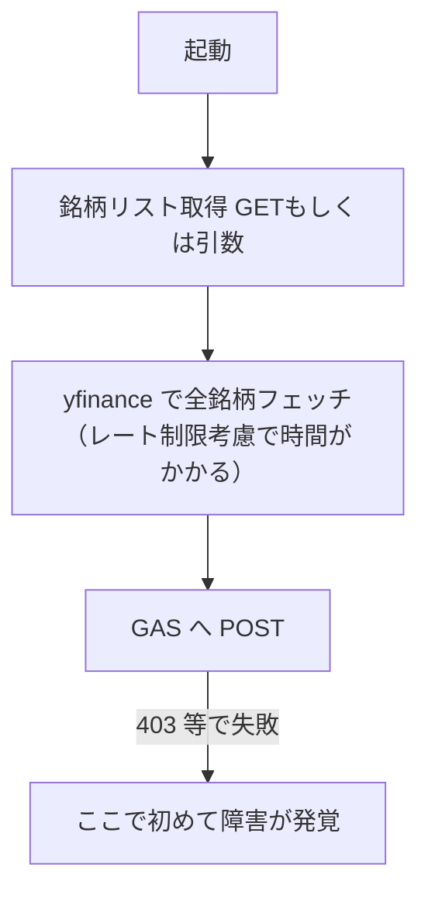

## 概要
`price_updater.py` 実行時、GAS エンドポイントの障害（デプロイ無効化・アクセス権変更による 403 等）は
yfinance のフェッチを終えた後の POST で初めて発覚する。issue 002 では実際に、GAS 側の権限変更により
403 Forbidden が発生し、株価取得を一通り終えた後に失敗が判明した。
実行前に GAS エンドポイントの疎通を確認する仕組みを設け、外部依存障害を早期に検知できるようにする。


## 出典
- `.claude/issues/002.md`（2026-06-06 16:51:15 の作業記録：GAS への POST が 403 Forbidden、GET も 403）


## 詳細
現状の処理順序は概ね以下で、GAS の異常は「全銘柄フェッチ後の POST」まで検知されない。



108銘柄規模では C のフェッチに相応の時間がかかるため、D で初めて GAS 障害が判明すると
それまでの待ち時間が無駄になる。起動直後に軽量な疎通チェックを挟むことで、
障害時は即座に中断・通知でき、運用が安定する。

### 検討ポイント
- GAS は GET ハンドラ（`doGet`）も持つため、軽量な GET による疎通確認が候補
- 正常時のレスポンス形（JSON か）と異常時（Google の HTML エラーページ）を区別して判定する
- `GAS_ENDPOINT_URL` 未設定・到達不可・403/非200 を区別してログ出力する
- フェッチ前に 1 回だけ実施し、失敗時は早期 return（exit code を非0に）


## 方針
- `price_updater.py` に GAS エンドポイントへの事前疎通チェック関数を追加する
- 株価フェッチ処理に入る前に呼び出し、異常時はエラーログを残して処理を中断する
- 既存の GET（銘柄リスト取得）処理と重複・統合できるか実装時に確認する


## 実装内容
実装時に既存コードを確認のうえ確定する。想定する骨子：

```python
def check_gas_endpoint(url: str) -> None:
    """GAS エンドポイントの疎通を事前確認する。異常時は例外を送出。"""
    # 軽量 GET を投げ、ステータスコードと Content-Type / 本文を検査
    # 403 や HTML エラーページ（アクセス拒否）を検知したら明示的に中断
```


## スコープ外
- GAS 側（`code.gs` 等）の変更
- リトライ・通知チャネル（メール/Slack 等）の追加。まずは検知と早期中断に限定する


## 完了条件
- [ ] フェッチ前に GAS エンドポイントの疎通を確認する処理が実装されている
- [ ] GAS が 403 等で異常な場合、フェッチに入る前に明確なエラーログを出して中断する
- [ ] 正常時は従来通り処理が継続する
- [ ] 当該処理に対するテストがある（issue 005 のテスト基盤と整合）


## 関連情報
- `.claude/issues/002.md`（GAS 403 障害の実例）
- issue 005（自動テスト導入）— テスト基盤を共有する


## 作業記録
## 2026-06-06 17:48:09
issue 起票。issue 002 で表面化した GAS 403 障害の早期検知を目的とする。未着手。
