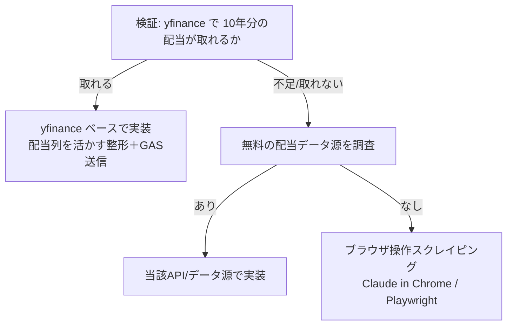

## 概要
スプレッドシートの `list` シートでは各銘柄ごとに「10年分の配当金」を保持している。
これを自動取得したい。当初「yfinance では配当は取れない」と考えていたが、
issue 002 で yfinance を 1.4.1（メジャー更新）にアップグレード済みであり、
**取得した生データには既に `Dividends` 列が含まれている**（現状は整形時に捨てている）。

そこでまず「yfinance で日本株の配当履歴がどこまで取れるか」を実検証し、
取れるなら yfinance ベースで、取れないなら別手段（無料API / ブラウザ操作スクレイピング）で実装する。


## 出典
- `.claude/issues/002.md`（yfinance 1.4.1 へのアップグレード、生データに `Dividends/Stock Splits` 列を確認）
- `src/python/price_updater.py:49-50`（`Open/High/Low/Close/Volume` のみ抽出し配当列を破棄している箇所）


## 詳細
現状の `fetch_single_stock_data` は以下で配当列を捨てている：

```python
data = data[['Open', 'High', 'Low', 'Close', 'Volume']]
data.columns = ['open', 'high', 'low', 'close', 'volume']
```

yfinance には配当の時系列を返す API があり、日本株（`.T`）でも返る可能性がある：
- `Ticker.dividends`（配当の時系列 Series）
- `Ticker.history(period="10y")` の `Dividends` 列
- `Ticker.actions`（配当・分割の複合）



実行頻度は「3ヶ月に1回程度」で十分（ユーザー談）。リアルタイム性は不要。


## 方針
1. **まず検証**：代表的な日本株数銘柄で `Ticker.dividends` / `history(period="10y")` を叩き、
   - 配当履歴が返るか
   - 10年分（直近10年）を網羅できるか
   - 件数・期間・銘柄ごとの取得可否
   を確認する。レート制限を考慮し銘柄数を絞り、銘柄間に待機を入れる。
2. 取得可否の結果に応じて実装方針を確定する（上図のフロー）。
3. 実装は TDD（issue 005 のテスト基盤を活用、外部 I/O はモック）。


## スコープ外
- 検証段階では GAS / スプレッドシートへの書き込みは行わない（取得可否の確認に集中）
- 配当利回り等の指標計算ロジックの新規追加（必要なら別 issue）


## 完了条件
- [ ] yfinance で日本株の配当履歴がどこまで取れるか検証結果を記録した
- [ ] 取得方針（yfinance / 別API / スクレイピング）を根拠付きで確定した
- [ ] 確定方針に沿った取得処理を実装し、テストが green
- [ ] （yfinance で取れる場合）`list` 相当の10年分配当を取得できることを確認した


## 関連情報
- issue 002（yfinance 1.4.1 アップグレード）
- issue 005（テスト基盤。本実装もこの上で TDD）


## 作業記録
## 2026-06-06 検証着手
issue 起票。yfinance メジャー更新後に日本株の配当履歴が取得可能になった可能性を、実銘柄で検証する。

## 2026-06-06 検証結果（取得可能を確認）
`venv/bin/python` で `yf.Ticker(code).dividends` を 3 銘柄叩いて検証。**いずれも配当履歴を取得できた**。

| 銘柄 | 件数 | 期間 |
|---|---|---|
| 2914.T (JT) | 53 | 2000-03-28 〜 2025-12-29 |
| 8058.T (三菱商事) | 53 | 2000-03-28 〜 2026-03-30 |
| 9984.T (ソフトバンクG) | 41 | 2000-03-28 〜 2026-03-30 |

- `Ticker.dividends` は **配当落ち日（ex-date）付きの 1 回ごとの 1株あたり配当額**を Series で返す（例: 2914.T 2025-12-29=130.0, 2025-06-27=104.0）
- 約25年分が返り、10年分は十分カバー。**スクレイピング不要、yfinance で完結できる見込み**
- 結論: 方針フローの「取れる」分岐で確定 → yfinance ベースで実装する

### 次の論点（実装前に要確認）
- `Ticker.dividends` は「都度（年2回など）」の支払い実績。`list` シートが持つのが
  「年度ごとの年間配当 × 10年」なのか「都度」なのか、**シートの列構造に合わせた集計（年度合算）が必要**。
  → 実装前に `list` シートの配当列の構造を確認する。

## 2026-06-06 list シート構造の確認
`ccskill-spreadsheet` スキルで `list` シート（34列 × 108行＝ヘッダー＋107銘柄）を読み取り。
配当まわりの列構成：

| 列 | ヘッダー | 意味 |
|---|---|---|
| H | 配当利回り | 算出値 |
| I | 配当 | 最新の年間配当（＝配当0と同値） |
| J〜T | 配当10, 配当9, …, 配当1, 配当0 | 過去11年分の「年間配当（円）」。配当0=最新年度、配当10=10年前 |
| U | 配当SPARKLINE | 推移グラフ |
| V/W/X | 連増 / 維持 / 減配 | 配当列から算出する派生指標 |
| F/G | 🏢BC情報 / 📈BC株価 | buffett-code の企業/株価ページURL |

→ 保持しているのは「**年度ごとの年間配当**」。yfinance の都度配当を**年度合算**する必要がある。

## 2026-06-06 年度区切りの検証（タマホーム 1419）
list の 1419 配当10→0 = `10,10,15,30,53,70,100,125,180,185,195`。
yfinance `dividends` を合算して突合：
- **暦年合算**：一部のみ一致（配当6/7 などズレ）
- **会計年度合算（6月始まり＝5月決算）**：11年中 **9年一致**。暦年でズレた配当6=53/配当7=30 も一致
  - → 区切りは「暦年」ではなく「決算月基準の会計年度」で正しいと確認
- 残る乖離 2 件：配当1=185（実績 FY2024=190）、配当4=100（実績 FY2021=60）

## 2026-06-06 乖離ソースと buffett-code アクセス検証
- ユーザー談：乖離を埋める正確なソースは **buffett-code**。従来はこれをスクレイピングしていた。F/G列にURL。
- `https://www.buffett-code.com/company/1419/` を WebFetch → **403 Forbidden**（bot 対策）。
  プログラムからの直接取得は不可。従来のスクレイピングはブラウザ経由（ログイン済みセッション）と推測。
- **決算月の自動取得**は別課題として保留（ユーザー認識済み）。

### 現時点の整理（方針はユーザー確認待ち）
- yfinance：無料・安定・403なし。会計年度合算で大半の年は取得可（タマホームで 9/11）
- buffett-code：正確だが 403。取得にはブラウザ操作（Claude in Chrome 等）が必要
- 想定される方針：(a) yfinance メインで自動運用 / (b) buffett-code をブラウザ操作で再現 / (c) ハイブリッド（yfinance で大枠＋乖離のみ buffett-code 補完）

## 2026-06-07 ゴール再定義とソース再検討
ユーザーから以下の重要情報：
- 既存 `list` の配当値は**ユーザーが buffett-code を目視して手入力**したもの。**完全一致は目的でない**（既存値自体が正とは限らない）。
- buffett-code は**ログイン必須**化 → 自動取得ソースとしては不採用。
- 代替候補として **irbank**（例: https://irbank.net/E00659/dividend）の提案。

→ ゴールを「既存値の再現」から「**信頼できる無料ソースから配当実績を取得し list を更新**」へ再定義。

## 2026-06-07 irbank 検証
- `https://irbank.net/3941/dividend`（レンゴー）を検証。**証券コード直アクセス可**（EDINETコード E00659 でなくてもよい）、**ログイン不要**。
- Python `curl_cffi`（impersonate=chrome）で **HTTP 200 取得成功**（403 なし）＝**ブラウザ操作不要**。`lxml` でパース可。
- 決算期ごとに 中間/期末/合計 が並ぶ（過去十数年）。決算月推定が不要になる利点。

### ⚠️ 落とし穴（確定実績の抽出が単純でない）
配当メインテーブルは「実績/修正/**予想（改訂履歴）**」が混在。年度セルに rowspan が付き、各行の「区分」が実績とは限らない。
- 例（レンゴー 2024年3月期）：生パースの合計列＝**24**（中間12/期末12、古い予想）。一方 WebFetch の LLM 整形＝**30**（実際の確定実績、中間12/期末18）。
- → 生 HTML を単純パースすると**古い予想値を拾う**リスク。WebFetch（小型 LLM）は正しい実績を返したが、これは実装に組み込めない。
- 確定実績を正確に取るには、ページ内の「確定実績」表現（別要素 / 最新改訂行の特定 / グラフ用データ等）を**追加特定するパーサの作り込み**が必要。

### yfinance との比較（参考）
- タマホーム配当4の乖離（list手入力100 vs yfinance会計年度60）は、**yfinance が中間配当を取りこぼした**ため（生 ex-date に該当中間が無かった）。日本株では irbank の方が網羅的で正確。

### 次の判断（ユーザー確認）
- (A) **irbank 深掘り**：確定実績はページに存在する（WebFetch が取得できた）。別要素の特定で正確取得できる見込み。日本株で最も正確。←推奨
- (B) **yfinance 会計年度合算**：実装は素直。ただし中間配当の欠損で一部年がズレうる。決算月は ex-date 月から推定。
- いずれの方針でも、GAS 側に「配当を受信して list 配当列(I〜T)を更新する処理」の新設が必須（現状 GAS は配当未対応を確認済み）。

### irbank 深掘りの結論（2026-06-07）
- irbank ページの table は 1 つのみ＝予想改訂履歴。確定実績の構造化データ（グラフ用 JSON 等）は無し。
- 確定実績の根拠は**適時開示の本文（自然言語）**：「2024年３月期の年間配当金は１株につき30円…」。
- → プログラムでの確定実績抽出は自然言語パースが必要で、3ヶ月に1回の自動運用には脆すぎる。**irbank 不採用**。

## 2026-06-07 ★決定：配当ソースは yfinance
ユーザー判断で **yfinance に確定**。理由：ex-date 実績が構造化されており実装が堅くテスト容易、追加依存なし、
既存値は手入力で不正確なため構造化実績で十分な改善。irbank は将来の精度補正用の参照に留める。

### 実装計画（TDD・issue 005 のテスト基盤上）
1. **決算月の確定**：yfinance `info['lastFiscalYearEnd']` から決算月を取得（取れない場合は ex-date 月から推定にフォールバック）
2. **会計年度合算**：`Ticker.dividends`（ex-date 付き）を決算月基準の会計年度でグルーピングし年間配当を算出（純粋関数・テスト対象）
3. **11年分マッピング**：配当0（最新確定年度）〜配当10。実績のみ採用
4. **Python→GAS POST**：配当ペイロードを送信
5. **GAS 側新設**：配当を受信し list 配当列(I〜T)を更新する処理（現状 GAS は配当未対応）
6. 全体疎通確認

## 2026-06-07 決算月の確定方法を検証
`info['lastFiscalYearEnd']` で決算日(=決算月＋最新確定会計年度)が正確に取得できることを確認：
- 1419 タマホーム → 2025-05-31（5月決算）
- 3941 レンゴー → 2026-03-31（3月決算）
- 2914 JT → 2025-12-31（12月決算）
→ 決算月の推定は不要。`lastFiscalYearEnd.year` を配当0（最新確定年度）の基準にできる。

## 2026-06-07 T1/T2 実装（dividend_updater.py）
- `src/python/dividend_updater.py` を新規作成（追加依存なし。yfinance/pandas は既存）
  - `fiscal_year_of` / `aggregate_annual_dividends` / `build_annual_series`（純粋関数）
  - `fetch_annual_dividends`（yfinance 取得結合。`ticker_factory` でモック注入可）
- `tests/test_dividend_updater.py` で単体テスト 11 本（純粋ロジック＋モック取得）。`pytest` 全 22 passed。

### 実データ実証
| 銘柄 | yfinance 配当0..10 | 評価 |
|---|---|---|
| 3941 レンゴー | 40,30,30,24,24,24,20,14,12,12,12 | irbank 実績と**完全一致** |
| 1419 タマホーム | 195,190,180,125,60,70,53,30,15,10,10 | 9/11 一致 |
| 1419 list(手入力) | 195,185,180,125,100,70,53,30,15,10,10 | 参考 |

- タマホーム配当1：yfinance 190 が正（手入力 185 は誤り）
- タマホーム配当4：yfinance 60 は**中間配当取りこぼし**（手入力 100 が正）。yfinance の既知の弱点
- 中間欠損のない銘柄（レンゴー等）は完全一致。ロジックの妥当性を確認。

### 残タスク
- T3：複数銘柄を回す取得スクリプト本体＋GAS への配当 POST（price_updater との共通化検討）
- T4：GAS 側に配当受信→list 配当列(I〜T)更新処理を新設
- T5：全体疎通確認（実シート反映）
- 中間配当取りこぼしへの対応方針（許容 or 補正）は T3 以降で判断
