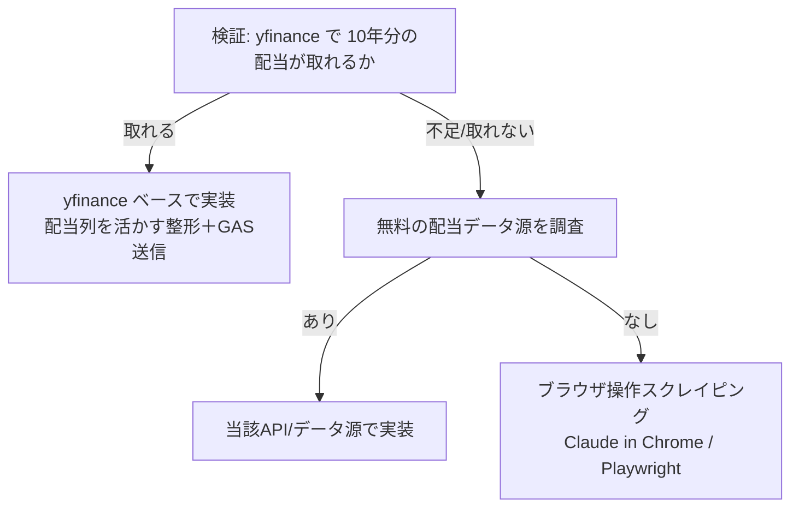

## 概要
スプレッドシートの `list` シートでは各銘柄ごとに「10年分の配当金」を保持している。
これを自動取得したい。当初「yfinance では配当は取れない」と考えていたが、
issue 002 で yfinance を 1.4.1（メジャー更新）にアップグレード済みであり、
**取得した生データには既に `Dividends` 列が含まれている**（現状は整形時に捨てている）。

そこでまず「yfinance で日本株の配当履歴がどこまで取れるか」を実検証し、
取れるなら yfinance ベースで、取れないなら別手段（無料API / ブラウザ操作スクレイピング）で実装する。


## 出典
- `.claude/issues/002.md`（yfinance 1.4.1 へのアップグレード、生データに `Dividends/Stock Splits` 列を確認）
- `src/python/price_updater.py:49-50`（`Open/High/Low/Close/Volume` のみ抽出し配当列を破棄している箇所）


## 詳細
現状の `fetch_single_stock_data` は以下で配当列を捨てている：

```python
data = data[['Open', 'High', 'Low', 'Close', 'Volume']]
data.columns = ['open', 'high', 'low', 'close', 'volume']
```

yfinance には配当の時系列を返す API があり、日本株（`.T`）でも返る可能性がある：
- `Ticker.dividends`（配当の時系列 Series）
- `Ticker.history(period="10y")` の `Dividends` 列
- `Ticker.actions`（配当・分割の複合）



実行頻度は「3ヶ月に1回程度」で十分（ユーザー談）。リアルタイム性は不要。


## 方針
1. **まず検証**：代表的な日本株数銘柄で `Ticker.dividends` / `history(period="10y")` を叩き、
   - 配当履歴が返るか
   - 10年分（直近10年）を網羅できるか
   - 件数・期間・銘柄ごとの取得可否
   を確認する。レート制限を考慮し銘柄数を絞り、銘柄間に待機を入れる。
2. 取得可否の結果に応じて実装方針を確定する（上図のフロー）。
3. 実装は TDD（issue 005 のテスト基盤を活用、外部 I/O はモック）。


## スコープ外
- 検証段階では GAS / スプレッドシートへの書き込みは行わない（取得可否の確認に集中）
- 配当利回り等の指標計算ロジックの新規追加（必要なら別 issue）


## 完了条件
- [ ] yfinance で日本株の配当履歴がどこまで取れるか検証結果を記録した
- [ ] 取得方針（yfinance / 別API / スクレイピング）を根拠付きで確定した
- [ ] 確定方針に沿った取得処理を実装し、テストが green
- [ ] （yfinance で取れる場合）`list` 相当の10年分配当を取得できることを確認した


## 関連情報
- issue 002（yfinance 1.4.1 アップグレード）
- issue 005（テスト基盤。本実装もこの上で TDD）


## 作業記録
## 2026-06-06 検証着手
issue 起票。yfinance メジャー更新後に日本株の配当履歴が取得可能になった可能性を、実銘柄で検証する。

## 2026-06-06 検証結果（取得可能を確認）
`venv/bin/python` で `yf.Ticker(code).dividends` を 3 銘柄叩いて検証。**いずれも配当履歴を取得できた**。

| 銘柄 | 件数 | 期間 |
|---|---|---|
| 2914.T (JT) | 53 | 2000-03-28 〜 2025-12-29 |
| 8058.T (三菱商事) | 53 | 2000-03-28 〜 2026-03-30 |
| 9984.T (ソフトバンクG) | 41 | 2000-03-28 〜 2026-03-30 |

- `Ticker.dividends` は **配当落ち日（ex-date）付きの 1 回ごとの 1株あたり配当額**を Series で返す（例: 2914.T 2025-12-29=130.0, 2025-06-27=104.0）
- 約25年分が返り、10年分は十分カバー。**スクレイピング不要、yfinance で完結できる見込み**
- 結論: 方針フローの「取れる」分岐で確定 → yfinance ベースで実装する

### 次の論点（実装前に要確認）
- `Ticker.dividends` は「都度（年2回など）」の支払い実績。`list` シートが持つのが
  「年度ごとの年間配当 × 10年」なのか「都度」なのか、**シートの列構造に合わせた集計（年度合算）が必要**。
  → 実装前に `list` シートの配当列の構造を確認する。
