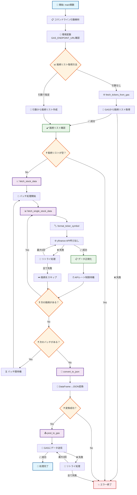
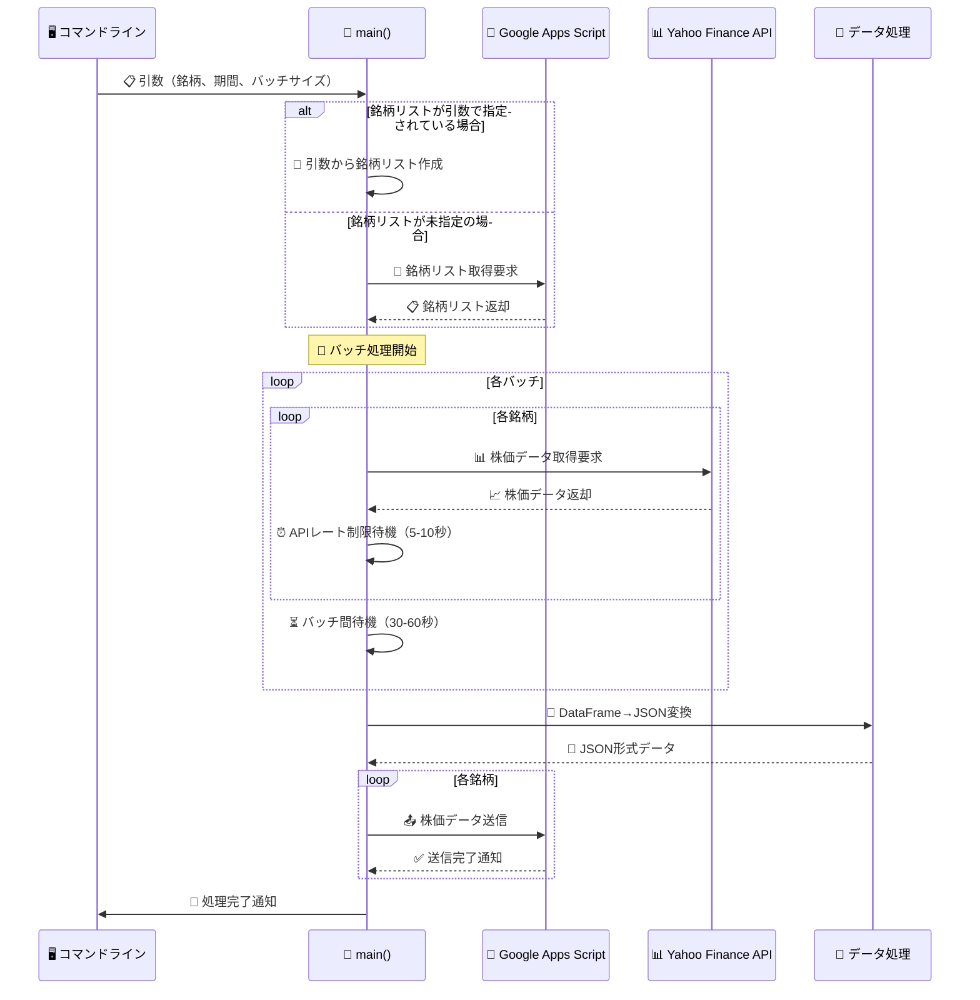
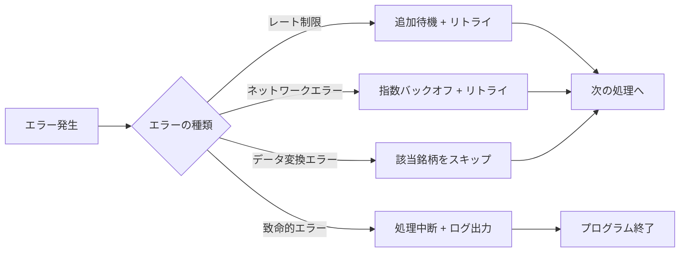

# Stock Watcher - 処理アーキテクチャ解説

このドキュメントでは、`price_updater.py`スクリプトの処理フローと関数の相関関係について詳しく解説します。

## 概要

Stock Watcherは、Yahoo Finance APIから株価データを取得し、Google Apps Script（GAS）に送信して更新するPythonスクリプトです。レート制限対応、エラーハンドリング、バッチ処理機能を備えた堅牢な設計となっています。

## 全体の処理フロー



## 関数の依存関係

```mermaid
graph TD
    A[🎯 main] --> B[📡 fetch_tickers_from_gas]
    A --> C[📈 fetch_stock_data]
    A --> D[🔄 convert_to_json]
    A --> E[📤 post_to_gas]
    
    C --> F[📊 fetch_single_stock_data]
    F --> G[🏷️ format_ticker_symbol]
    
    B -.->|@retry装飾子| H[🔄 tenacity リトライ機能]
    E -.->|@retry装飾子| H
    F -.->|@retry装飾子| H
    
    I[📊 yfinance] --> F
    J[🌐 requests] --> B
    J --> E
    K[📋 pandas] --> F
    K --> D
    L[📝 logging] --> M[🔧 全ての関数]
    
    classDef main fill:#e1f5fe,stroke:#01579b,stroke-width:3px;
    classDef dataFetch fill:#f3e5f5,stroke:#4a148c,stroke-width:2px;
    classDef utility fill:#fff3e0,stroke:#e65100,stroke-width:2px;
    classDef external fill:#e8f5e8,stroke:#2e7d32,stroke-width:2px;
    classDef retry fill:#ffebee,stroke:#c62828,stroke-width:2px;
    
    class A main;
    class B,C,E,F dataFetch;
    class D,G utility;
    class I,J,K,L external;
    class H retry;
```

## データフロー（シーケンス図）



## 主要機能の詳細

### 1. リトライ機能 🔄

各重要な関数には`@retry`装飾子が適用され、一時的な障害に対して自動的にリトライを実行します。

| 関数 | 最大リトライ回数 | 待機戦略 | 対象エラー |
|------|-----------------|----------|------------|
| `fetch_single_stock_data` | 5回 | 指数バックオフ（10-60秒） | API接続エラー、レート制限 |
| `post_to_gas` | 3回 | 指数バックオフ（4-10秒） | HTTP通信エラー |
| `fetch_tickers_from_gas` | 3回 | 指数バックオフ（4-10秒） | HTTP通信エラー |

### 2. バッチ処理 📦

大量の銘柄を効率的に処理するため、指定されたバッチサイズで分割して処理します。

```python
# デフォルト設定
batch_size = 5  # 1バッチあたりの銘柄数
wait_time = 5.0-10.0秒  # 銘柄間の待機時間
batch_wait = 30.0-60.0秒  # バッチ間の待機時間
```

### 3. レート制限対応 ⏰

Yahoo Finance APIのレート制限を回避するため、複数の待機戦略を実装：

- **通常待機**: 各銘柄取得後に5-10秒のランダム待機
- **バッチ間待機**: バッチ完了後に30-60秒のランダム待機
- **エラー時追加待機**: レート制限エラー検出時に30-60秒の追加待機

### 4. エラーハンドリング 🛡️

各処理段階で適切なエラーハンドリングを実装：



## 設定パラメータ

### コマンドライン引数

| 引数 | 説明 | デフォルト値 | 例 |
|------|------|-------------|-----|
| `tickers` | カンマ区切りの銘柄コード | 空（GASから取得） | `"7203,6758,9984"` |
| `--period` | データ取得期間 | `"10d"` | `"1mo"`, `"3mo"`, `"1y"` |
| `--batch-size` | バッチサイズ | `5` | `3`, `10` |

### 環境変数

| 変数名 | 必須 | 説明 |
|--------|------|------|
| `GAS_ENDPOINT_URL` | ✅ | Google Apps ScriptのエンドポイントURL |

## ログ出力形式

```
2025-07-05 10:30:15 - INFO - 開始: 全3銘柄のデータを取得します（バッチサイズ: 5）
2025-07-05 10:30:15 - INFO - バッチ処理 1-3/3: 3銘柄を処理します
2025-07-05 10:30:16 - INFO - データ取得開始: 7203.T
2025-07-05 10:30:17 - INFO - [1/3] 7203: 成功
2025-07-05 10:30:27 - INFO - データ取得開始: 6758.T
2025-07-05 10:30:28 - INFO - [2/3] 6758: 成功
2025-07-05 10:30:38 - INFO - データ取得開始: 9984.T
2025-07-05 10:30:39 - INFO - [3/3] 9984: 成功
2025-07-05 10:30:39 - INFO - 取得完了: 3/3銘柄のデータを取得しました
2025-07-05 10:30:40 - INFO - 処理が正常に完了しました
```

## 使用例

```bash
# 環境変数設定
export GAS_ENDPOINT_URL="https://script.google.com/macros/s/YOUR_SCRIPT_ID/exec"

# 特定の銘柄を指定して実行
python src/python/price_updater.py "7203,6758,9984" --period 1mo --batch-size 3

# GASから銘柄リストを取得して実行
python src/python/price_updater.py --period 10d

# ヘルプ表示
python src/python/price_updater.py --help
```

## 技術スタック

- **Python 3.x**
- **yfinance**: Yahoo Finance APIクライアント
- **pandas**: データ処理・分析
- **requests**: HTTP通信
- **tenacity**: リトライ機能
- **python-dotenv**: 環境変数管理

## 今後の改善案

1. **並列処理**: `concurrent.futures`を使用した並列データ取得
2. **キャッシュ機能**: 取得済みデータのローカルキャッシュ
3. **メトリクス収集**: 処理時間・成功率の統計情報
4. **設定ファイル**: YAML/TOMLによる設定外部化
5. **通知機能**: 処理完了・エラー時のSlack/Email通知
